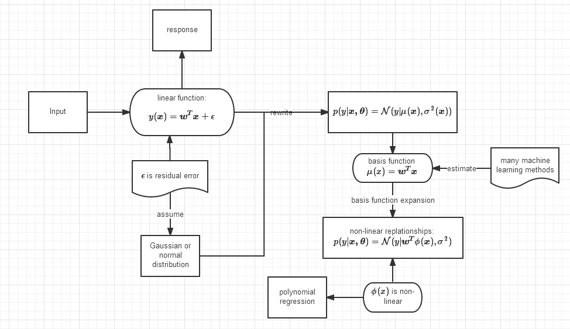

knowledge
=========
knowledge 是一个快速创建流程图，并用图形化的方式展示知识点之间的逻辑关系的笔记工具。它是一个Web应用程序，且与印象笔记有着紧密的关系。knowledge不仅可以显示使用者的印象笔记账户中的笔记本、笔记内容，更重要的是使用程序画成的流程图会以特殊的文件格式保存成为印象笔记的笔记附件，与笔记内容一起同步到印象笔记的服务器端。因此使用者绘制的图形可以在多种设备之间共享。

为了提高学习数学的效率，knowledge专门集成了Latex的数学公式绘制引擎。在图形中可以像编写普通文字一样轻松输入数学公式，并可以达到数学公式的所见即所得的效果。

目前程序仅具备初步的基本功能，相关的功能还在不断地完善中，欢迎提出各种意见和建议。



# 安装

## 下载源代码

``` sh
git clone https://github.com/suyuxin/knowledge.git knowledge
cd knowledge
git submodule init
git submodule update
```

##安装python以及Django
程序使用python Django的Web开发框架，因此使用者需要先安装python2.7 以及最新版的Django。

如果已安装python的pip软件下载工具包，可以使用如下命令安装Django以及oauth2(在请求使用者的印象笔记账户授权时需要使用)：

```sh
pip install Django oauth2
```

#运行程序
第一次使用时需要首先创建数据库，因此进入knowledge文件夹后输入

```sh
python manage.py syncdb
```
创建成功数据库之后就可以运行程序：

```sh
python manage.py runserver
```

默认情况下，只能在本机访问knowledge，地址为：http://127.0.0.1:8000 如需外部访问，需输入：

```sh
python manage.py runserver 0.0.0.0:8000
```

未来会将knowledge程序迁移至亚马逊的AWS平台，就不用再进行本地服务器端设置。